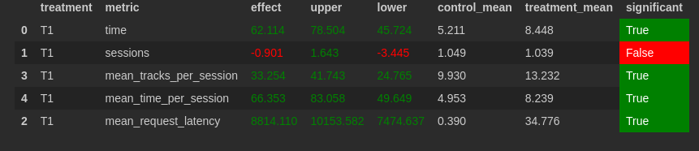

i. Идея
Будем предлагать пользователям треки, похожие на те, которые уже нравились ему или похожим на него пользователям. Похожие пользователи - рользователи, у которых большое совпадение по длительности прослушивания одних и тех же треков.
Для каждого пользователя считаем суммарную похожесть на других пользователей, делим на неё похожести на конкретных пользователей и используем данные значения в качестве коэффициентов.
Также, смотрим треки, похожие на те, что нам уже нравились. Для них коэффициент равен 1.
В обоих случаях вес трека (чем больше вес, тем больше вероятность), равен сумме произведдений коэффициента на длительность прослушивания (текущим пользователем или похожим на него).
Затем ищем треки, похожие на выбранный.

ii. Детали
Используем переменную data для хранения пар вида [track_id, track_listening_time].
Для поиска похожих пользователей каждые 20 итераций чистим переменную similar_users, затем для всех пар пользователей считаем их похожести.
Похожесть равна сумме |li1 - li2|, где li1 - время прослушивания трека i первым пользователем, li2 - вторым.
Сумма считается по всем трекам, которые прослушали оба пользователя.

iii. Результаты

т

iiii. Инструкция.
Запускать так же, как и раньше, ничего не поменялось.
